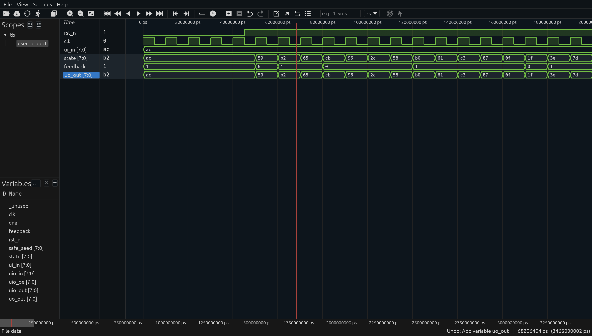
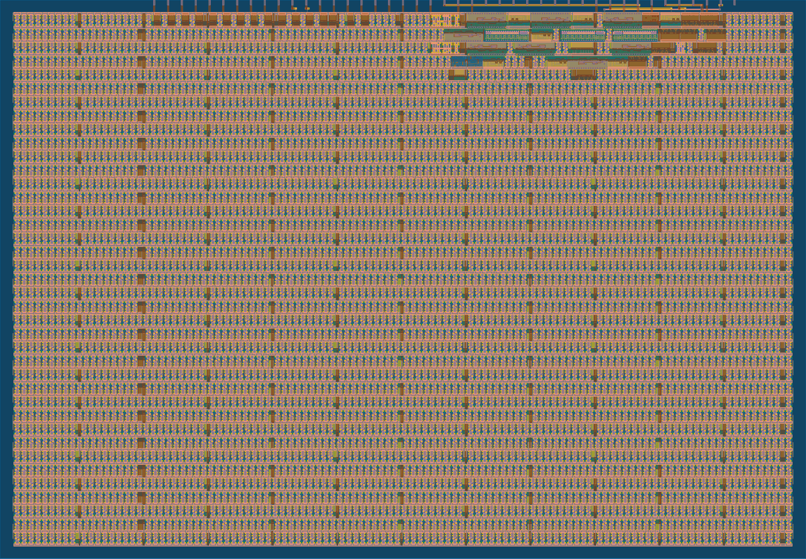

# Presentation & Study Guide — `tt_um_arielfayol37`

A self-contained reference for studying the design and presenting it. Read it
top-to-bottom once; come back to individual sections during the talk.

---

## 1. One-paragraph pitch

The chip is an **8-bit Fibonacci Linear Feedback Shift Register (LFSR)**. It
takes an 8-bit *seed* on `ui_in[7:0]` while the chip is in reset, and once
reset is released it produces a deterministic 255-cycle pseudo-random
sequence on `uo_out[7:0]`. Every non-zero 8-bit value appears exactly once
per period, then the sequence loops. The whole thing is a 9-flop, single-XOR
circuit that fits in ~50 µm² of sky130 silicon.

---

## 2. Why an LFSR?

LFSRs aren't a toy — they're in real chips. Things you can name during the talk:

| Where they show up | What they do |
|---|---|
| **Built-In Self-Test (BIST)** in CPUs/SoCs | Drive pseudo-random patterns into a circuit, hash the responses to detect manufacturing defects. |
| **CRC generators** (Ethernet, USB, PCIe, storage) | The polynomial-divide step *is* an LFSR. CRC-32 is a 32-bit LFSR with specific taps. |
| **Scramblers** (10GbE PCS, SATA, PCIe) | Whiten serialised data so it has enough transitions for clock recovery and even spectral content. |
| **Spread-spectrum / GPS** | Gold codes are XORs of two LFSRs. |
| **Cheap noise/random sources** | Game consoles (NES "white noise" channel), MIDI, retro audio. |
| **Counters with a different topology** | An *n*-bit LFSR counter uses fewer gates than a binary counter — historically used when transistors were expensive. |

The talk-friendly framing: *"It's a one-XOR circuit that produces the same
output stream the receiver does, so they can sync up — that's the core of
how Ethernet stays in sync without sending a clock."*

---

## 3. The math (just enough)

### Why "linear feedback"
Each new bit is the **XOR** of selected prior bits. XOR is the only non-trivial
linear operation over GF(2) (the field {0,1}), hence "linear".

### Why "Fibonacci"
There are two LFSR styles. **Fibonacci** computes the new bit *outside* the
register (one big XOR fed back to the input). **Galois** XORs the feedback
*into* multiple register positions in parallel. Both produce equivalent
sequences with the right tap choice; Fibonacci is conceptually simpler.

### Why period 255
- An 8-bit register has 2⁸ = 256 possible states.
- The all-zero state is a *fixed point*: feeding 0 into the XOR keeps producing 0.
- So a maximal-length LFSR cycles through the **other 255 states** exactly once before repeating.
- Whether you actually hit all 255 depends on the *characteristic polynomial*. Not every polynomial works — only **primitive polynomials** over GF(2) do.

### Our polynomial
$$x^8 + x^6 + x^5 + x^4 + 1$$

This is one of 16 primitive polynomials of degree 8. Tap positions correspond
to the non-zero coefficients (excluding the leading $x^8$ and the trailing 1).
That's why we tap bits 6, 5, 4 plus the MSB (bit 8 = output).

In code, with `state[7:0]` zero-indexed:
- "bit 8" = `state[7]`
- "bit 6" = `state[5]`
- "bit 5" = `state[4]`
- "bit 4" = `state[3]`

```verilog
wire feedback = state[7] ^ state[5] ^ state[4] ^ state[3];
```

---

## 4. Verilog walkthrough (`src/project.v`)

```verilog
module tt_um_arielfayol37 (
    input  wire [7:0] ui_in,    // dedicated inputs  -> SEED
    output wire [7:0] uo_out,   // dedicated outputs -> STATE
    input  wire [7:0] uio_in,   // bidirectional in  (unused)
    output wire [7:0] uio_out,  // bidirectional out (unused, tied 0)
    output wire [7:0] uio_oe,   // bidirectional OE  (all inputs)
    input  wire       ena,      // always 1 when chip is selected
    input  wire       clk,      // 50 MHz clock
    input  wire       rst_n     // active-low synchronous reset / seed-load
);
```
> The port list is fixed by Tiny Tapeout — every project has the same shape,
> only the *meaning* of `ui_in` and `uo_out` changes. We use `ui_in` for the
> seed and `uo_out` for the LFSR state. The bidirectional I/Os we don't need.

```verilog
  reg [7:0] state;
```
> The 8 D-flip-flops that hold the register. Each `state[i]` becomes one
> physical flop on the chip.

```verilog
  wire [7:0] safe_seed = (ui_in == 8'h00) ? 8'h01 : ui_in;
```
> If the user feeds an all-zero seed the LFSR would lock at zero forever (the
> XOR of all-zeros is zero, no matter the taps). This one-line guard rewrites
> a 0-seed to `0x01` so the design is foolproof.

```verilog
  wire feedback = state[7] ^ state[5] ^ state[4] ^ state[3];
```
> The single XOR gate. Four inputs, one output, zero clock cycles of latency
> — pure combinational logic.

```verilog
  always @(posedge clk) begin
    if (!rst_n) state <= safe_seed;
    else        state <= {state[6:0], feedback};
  end
```
> The whole sequential behaviour:
> - On every rising clock edge, we pick one of two values for `state`.
> - If `rst_n` is **low**, load the seed (synchronous reset/load).
> - Otherwise, **shift left**: discard the old MSB, push the feedback bit in
>   at the LSB.
>
> *Why synchronous reset?* The sky130 standard-cell library has flip-flops
> with async reset to a *constant* (0 or 1), but no flop can async-load an
> arbitrary 8-bit value. Synchronous reset becomes a 2:1 mux at each flop's
> D-input, which Yosys maps cleanly to library cells. (We hit this exact
> problem on the first GDS run — see commit `76697d1`.)

```verilog
  assign uo_out  = state;
  assign uio_out = 8'b0;
  assign uio_oe  = 8'b0;
  wire _unused = &{ena, uio_in, 1'b0};
```
> Outputs: expose the state on the dedicated output pins, drive bidirectional
> outputs to zero, configure bidirectionals as inputs (`uio_oe = 0`). The
> `_unused` line is a lint trick — referencing a signal in any expression
> tells Verilator "yes, I know I'm not using this", silencing the warning.

---

## 5. Cocotb test walkthrough (`test/test.py`)

The test has three independent assertions, each backed by a Python reference model:

```python
def lfsr_step(state):
    fb = ((state >> 7) ^ (state >> 5) ^ (state >> 4) ^ (state >> 3)) & 1
    return ((state << 1) | fb) & 0xFF
```
> The exact same computation as the Verilog, in software. We trust the
> hardware iff hardware output == software output for every cycle.

### Test 1 — `test_lfsr_sequence`
Reset with seed `0xAC`, then clock 255 times. Each cycle, compare hardware
state to the reference. Final asserts: every state in the period was unique
(maximal length), and the final state equals the seed (period == 255).
**Why this matters:** it's the strongest possible behavioural check — a
single tap error or a wrong shift direction would fail by cycle 1.

### Test 2 — `test_zero_seed_avoids_lockup`
Reset with seed `0x00`; verify the substitution to `0x01` kicks in and the
LFSR runs normally. **Why this matters:** without the `safe_seed` guard, a
user holding the input switches at zero would lock the chip dead.

### Test 3 — `test_different_seeds_diverge`
Run from three different seeds, capture 16-cycle traces, verify they're
distinct. **Why this matters:** sanity-checks that the seed actually
controls the output.

### A sampling subtlety worth knowing
We sample `uo_out` on the **falling edge** rather than right after the rising
edge. Cocotb returns from `await RisingEdge` *at* the active edge, before
non-blocking assignments propagate — so reads are stale by one cycle. Waiting
half a clock period (FallingEdge) gives the simulator time to settle.

---

## 6. Pin assignments (slide-ready)

Drop this directly into a slide:

| Pin (TT name) | Direction | Signal name | Purpose |
|---|---|---|---|
| `ui_in[0]` | input | `SEED[0]` | LFSR seed bit 0 |
| `ui_in[1]` | input | `SEED[1]` | LFSR seed bit 1 |
| `ui_in[2]` | input | `SEED[2]` | LFSR seed bit 2 |
| `ui_in[3]` | input | `SEED[3]` | LFSR seed bit 3 |
| `ui_in[4]` | input | `SEED[4]` | LFSR seed bit 4 |
| `ui_in[5]` | input | `SEED[5]` | LFSR seed bit 5 |
| `ui_in[6]` | input | `SEED[6]` | LFSR seed bit 6 |
| `ui_in[7]` | input | `SEED[7]` | LFSR seed bit 7 |
| `uo_out[0]` | output | `STATE[0]` | LFSR state bit 0 (LED) |
| `uo_out[1]` | output | `STATE[1]` | LFSR state bit 1 (LED) |
| `uo_out[2]` | output | `STATE[2]` | LFSR state bit 2 (LED) |
| `uo_out[3]` | output | `STATE[3]` | LFSR state bit 3 (LED) |
| `uo_out[4]` | output | `STATE[4]` | LFSR state bit 4 (LED) |
| `uo_out[5]` | output | `STATE[5]` | LFSR state bit 5 (LED) |
| `uo_out[6]` | output | `STATE[6]` | LFSR state bit 6 (LED) |
| `uo_out[7]` | output | `STATE[7]` | LFSR state bit 7 (LED) |
| `uio[0..7]` | — | unused | drive low / inputs |
| `clk` | input | clock | 50 MHz nominal |
| `rst_n` | input | reset_n | active-low; loads seed while asserted |
| `ena` | input | enable | always 1 when chip is selected |

Compact version (if you want one slide instead of three):

| Pins | Role |
|---|---|
| `ui_in[7:0]` | 8-bit seed (sampled while `rst_n = 0`) |
| `uo_out[7:0]` | current LFSR state — drive 8 LEDs |
| `clk`, `rst_n`, `ena` | TT standard control |
| `uio_*` | unused |

---

## 7. Sample sequence (talk this through on the waveform slide)

Starting from seed `0xAC = 10101100₂`, the first nine states are:

| Cycle | State (hex) | State (binary) |
|---|---|---|
| 0 (after reset) | `0xAC` | `1010 1100` |
| 1 | `0x59` | `0101 1001` |
| 2 | `0xB2` | `1011 0010` |
| 3 | `0x65` | `0110 0101` |
| 4 | `0xCB` | `1100 1011` |
| 5 | `0x96` | `1001 0110` |
| 6 | `0x2C` | `0010 1100` |
| 7 | `0x58` | `0101 1000` |
| 8 | `0xB0` | `1011 0000` |
| ... | ... | ... |
| 255 | `0xAC` | back to the seed |

Hand-derive cycle 1 on the slide as a sanity check:
- bits at tap positions of `0xAC = 10101100`: bit 7 = 1, bit 5 = 1, bit 4 = 0, bit 3 = 1
- feedback = 1 ⊕ 1 ⊕ 0 ⊕ 1 = **1**
- shift left, drop the old MSB, append the feedback: `0101 1001 = 0x59` ✓

---

## 8. Reading the waveform

The captured waveform is checked in as `docs/waveform.png`:



What it shows, top to bottom:

| Signal | What to point at on the slide |
|---|---|
| `rst_n` | Goes high near `~25,000 ps` — that's the moment the LFSR is "released". |
| `clk` | Free-running 100 kHz simulation clock (10 µs period). One rising edge per state transition. |
| `ui_in[7:0]` | Holds `ac` throughout — the seed we configured the test with. |
| `state[7:0]` | Starts at `ac` (the loaded seed), then on each rising edge becomes `59, b2, 65, cb, 96, 2c, 58, b0, c1, c3, b7, 8f, 1f, 3e, 7d, …` |
| `feedback` | The XOR output shifted into bit 0 — this is the bit that *makes* the next state. |
| `uo_out[7:0]` | Identical to `state` (it is `state` — exposed on the output pins). |

The talk-friendly point: *every state value looks random, but it's
**deterministic** — the same seed gives the same sequence every time. After
exactly 255 cycles `state` returns to `ac` and the whole cycle repeats.*

If you need to regenerate the waveform: download the `tb.fst` artifact from
the latest `test` workflow run, drop it into https://app.surfer-project.org/,
right-click each multi-bit signal → **Display format → Hex**, and screenshot.

---

## 9. From RTL to silicon — what LibreLane does

The GDS workflow runs about a dozen stages; the talk-relevant ones are:

| Stage | What happens | What it produces |
|---|---|---|
| **Linting** (Verilator) | Checks for common Verilog mistakes. | A pass/fail on style. |
| **Synthesis** (Yosys) | Translates the Verilog into sky130 standard cells: DFFs, NAND, NOR, etc. | A *netlist* — same logic, expressed as gates. |
| **Floorplanning** | Decides die size, IO ring, power grid. | An empty box of the right size with power rails. |
| **Placement** | Decides where on the die each gate physically goes. | Rectangles inside the box. |
| **Clock tree synthesis (CTS)** | Builds a buffered tree so all 8 flops see the clock at nearly the same instant. | A balanced clock network. |
| **Routing** | Connects every gate's pins with metal wires (5+ layers). | A finished layout. |
| **DRC / LVS** | Checks geometry rules (DRC) and netlist match (LVS). | Pass/fail confidence. |
| **Static timing analysis (STA)** | Verifies the longest combinational path fits in one 20 ns clock period at all process corners. | Slack reports. |
| **GDSII export** | Dumps the layout to a binary file the foundry can ingest. | `tt_um_arielfayol37.gds` |

The rendered layout is checked in as `docs/gds_render.png`:



When you point at this on the slide:
- The dense cluster at the **top-right** with the colored stripes is the actual
  LFSR logic — eight flops + the XOR + the seed-load muxes. It looks small
  because it *is* small (~50 µm² of "real" gates).
- The vast repeating field below it is **filler and decap cells** the flow
  inserts automatically. They contribute no logic; they exist to satisfy the
  fab's minimum-density rules (so the chemical-mechanical polish step doesn't
  dish out empty regions) and to provide local power-supply decoupling. Every
  TT design has them — the smaller the actual logic, the more of the tile is
  filler.
- The strip at the **very top edge** is the IO ring that connects to the
  parent TT chip's pin matrix.

---

## 10. Suggested slide outline (5–7 minutes)

1. **Title slide** — name, project title, what is Tiny Tapeout
2. **Motivation** — what an LFSR is and where they appear (sec 2 of this doc)
3. **Architecture** — the block diagram (`docs/block_diagram.png`)
4. **Verilog at a glance** — show the 5 key lines (the `feedback` wire and the `always` block); read them aloud
5. **Pin table** — section 6 of this doc
6. **Test results** — screenshot of the green `test` workflow + one sentence about what it proves
7. **Waveform** — your screenshot from sec 8, with seed → first 4–5 states annotated
8. **GDS layout** — screenshot from KLayout, callouts for "8 flops here", "XOR here"
9. **Summary / what I learned** — 3 bullets max

---

## 11. Anticipated questions (with answers ready)

> **"Why is the period 255 and not 256?"**
> Because the all-zero state is a fixed point of the XOR feedback — once you reach 0 you stay at 0. A maximal-length LFSR cycles through the other 2ⁿ−1 states.

> **"Is this actually random?"**
> No, it's *pseudo-random*. Same seed → same sequence, every time. It has good *statistical* properties (balanced 0s and 1s, uniform pair distribution) but it's fully predictable, so you'd never use it for crypto.

> **"Why these specific taps?"**
> The polynomial $x^8+x^6+x^5+x^4+1$ is one of 16 primitive polynomials of degree 8 over GF(2). Any of them gives a 255-period sequence; this one is widely tabulated (e.g. in Xilinx XAPP 052).

> **"What's the gate count?"**
> 8 D-flip-flops, one 4-input XOR (or three 2-input XORs), and the seed-load mux on each flop's D-input. Yosys will report the exact cell count in its synthesis log.

> **"What's the maximum clock frequency?"**
> Limited by the longest combinational path: flop → XOR (3 levels of 2-input XOR) → mux → flop. At sky130, that's well under 1 ns, so we're nowhere near the 20 ns clock period — could probably run at hundreds of MHz.

> **"Why synchronous reset?"**
> sky130 has flops with async reset to 0 or 1, but no flop with async load to an arbitrary value. Synchronous reset lets the seed value live in normal mux logic that maps to standard cells.

> **"What happens if I change `ui_in` after reset is released?"**
> Nothing — `ui_in` is only sampled while `rst_n` is low. During normal operation the design ignores it.

> **"How is this different from a counter?"**
> A binary counter visits states in numerical order (0, 1, 2, 3, ...). An LFSR visits the same set of states (minus zero) but in a *pseudo-random* order. Both are *n*-bit state machines with period ≤ 2ⁿ; the LFSR uses fewer gates because it has no carry chain.
