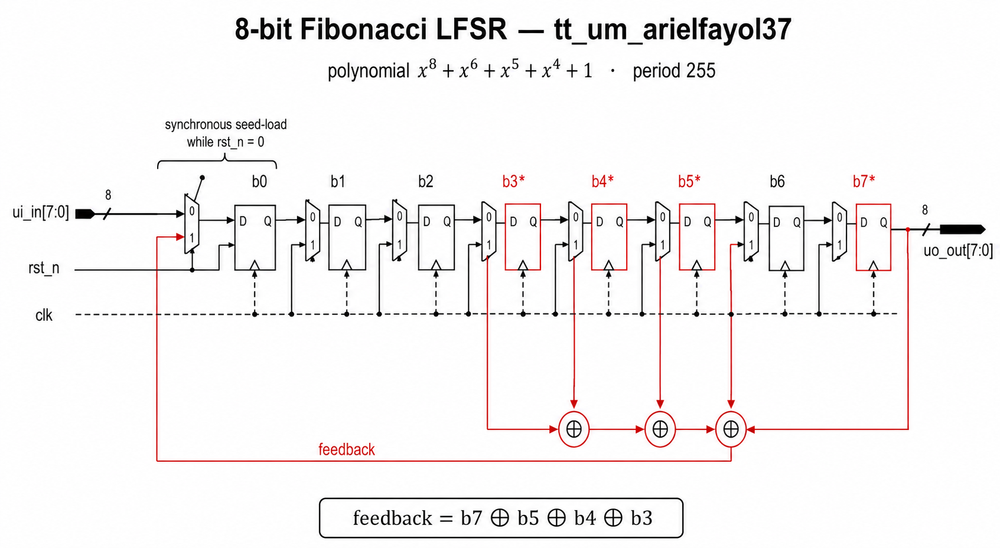

<!---
This file is used to generate your project datasheet.
-->

## How it works

This project is an **8-bit Fibonacci Linear Feedback Shift Register (LFSR)** that
produces a maximal-length pseudo-random bit sequence. The characteristic
polynomial is

```
x^8 + x^6 + x^5 + x^4 + 1
```

which has a period of `2^8 - 1 = 255` — every non-zero 8-bit value appears
exactly once before the sequence repeats.

On every rising clock edge the register shifts left by one. The bit shifted in
on the right is the XOR of taps at positions 8, 6, 5, 4 (i.e. bits
`state[7] ^ state[5] ^ state[4] ^ state[3]`). The current 8-bit state is
exposed on `uo_out` so it can light up an LED bar.

The starting value (the *seed*) is taken from `ui_in` while the chip is held in
reset (`rst_n = 0`). When reset is released, the LFSR begins to advance one
shift per clock. Because an all-zero seed would lock the LFSR at zero forever,
a seed of `0x00` is automatically substituted with `0x01`.

### Block diagram



The eight register cells (`b0`–`b7`) form a left-shifting register. On every
clock edge each cell takes the value of its left neighbour; the new bit at
`b0` is the XOR of the four taps marked with `*`. While `rst_n` is low, every
cell is overwritten with the corresponding bit of `ui_in`, so deasserting
reset releases the LFSR with the user-supplied seed.

## How to test

1. Drive a non-zero 8-bit seed onto `ui_in[7:0]`.
2. Hold `rst_n` low for a few clock cycles, then release it.
3. Provide a clock on `clk`. On every rising edge, `uo_out[7:0]` advances to
   the next state in the LFSR sequence.
4. After exactly **255** clock cycles, `uo_out` returns to the original seed.

The cocotb testbench in `test/test.py` exercises three properties:

- **`test_lfsr_sequence`** — the hardware matches a Python reference model
  for one full period of 255 cycles.
- **`test_zero_seed_avoids_lockup`** — feeding seed `0x00` is rewritten to
  `0x01`, and the register never reaches the all-zero state.
- **`test_different_seeds_diverge`** — different seeds produce different
  output streams.

Run it locally with:

```
cd test
make
```

### Simulation waveform


The trace above is from `test_lfsr_sequence` opened in Surfer. After
`rst_n` rises, `state` cycles through `ac → 59 → b2 → 65 → cb → 96 → 2c → 58
→ b0 → c1 → c3 → b7 → 8f → 1f → 3e → 7d → …`, exactly matching the Python
reference model. The single `feedback` bit you see toggling above `state` is
the XOR output that gets shifted into bit 0 on each clock.

## Layout


This is the placed-and-routed view of the chip from the LibreLane flow.
The dense cluster at the top-right is the actual LFSR logic — eight flops
plus the XOR and the seed-load muxes. The repeating rows that fill the rest
of the tile are filler/decap cells the flow adds to meet density and power
integrity rules; they do nothing electrically but are required by the
manufacturing process.

## Pin assignments

| Pin       | Direction | Name      | Purpose                                  |
|-----------|-----------|-----------|------------------------------------------|
| `ui_in[7:0]`  | input  | `SEED[7:0]`  | LFSR seed (sampled while `rst_n` is low) |
| `uo_out[7:0]` | output | `STATE[7:0]` | Current LFSR register state (LED bar)    |
| `uio_*`       | -      | unused    | Driven low / inputs                      |
| `clk`         | input  | clock     | 50 MHz nominal                           |
| `rst_n`       | input  | reset_n   | Active-low; loads seed while asserted    |
| `ena`         | input  | enable    | Always high when chip is selected        |

## External hardware

None required. Optional: an 8-LED Pmod (e.g. Digilent Pmod8LD) wired to the
`uo[7:0]` outputs lets you watch the pseudo-random pattern visually. Switches
or DIP-switch Pmod on `ui[7:0]` are useful for picking a seed.
